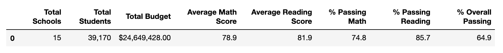
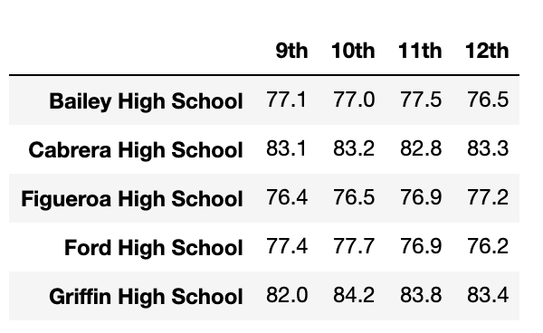
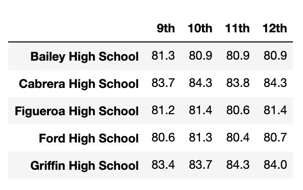

# School_District_Analysis
PyCitySchools with Pandas

## Overview
In this project, we have create a district and school information summary. The school district found that the test scores for ninth grade studetns in Thomas High School were incorrect, so they decided to update the data to find the correct grade information. In this case, we will replace the ninth grade math and reading scores for Thomas High School students.\
The ninth grade reading and math scores will be replaced as "NAN". There are a total number of 461 students affected. We will create a new summary sheet for the score replacements.

## Results
### School District Summary

### School Summary

### Top Five Performing Schools

### Bottom Five Performing Schools

### Average Math Scores by Grade

### Average Reading Scores by Grade

### School Spending

### School Size

### School Type

### Result Summary
* In the district summary, average math score dropped by 0.1%, the reading score, percentage of passing math, reading and both stay the same.
* In the school summary, only the score replacement only affect the result of Thomas High School. The average math score dropped by 0.06, and the average reading score increased by the 0.05. The percentage passing of math, reading and overall have drop slighly about 0.1%.
* The top five performing schools are still the same. The Thomas High School data has slightly changed as mentioned above.
* The lowest five performing schools remain the same.
* Grade ninth average score for Thomas High Shcool has been replaced by "NaN".
* Results from school spending, school size, school type are the same prior to the replacement
## Summary
In general, the replacement of incorrect grade lead to the decrease in passing percentage. The change is not signifiant to impact the school ranking compare to other schools in the same district.
